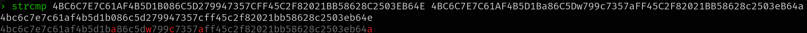

# strcmp-node

I couldn't find a string comparison command, so i made my own. its probably the ugliest thing since godzilla with makeup on, but it works.

# install
`npm i -g strcmp-node`

# usage

`strcmp str1 str2`

case-sensitive comparison:

`strcmp -c str1 str2`

